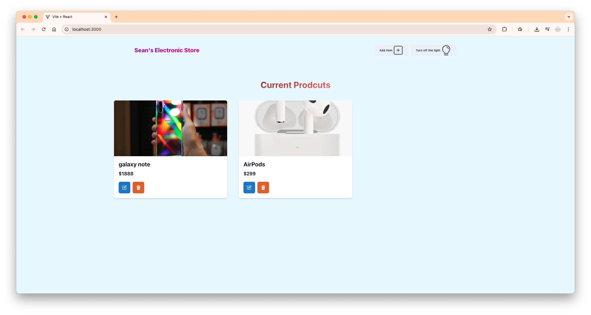
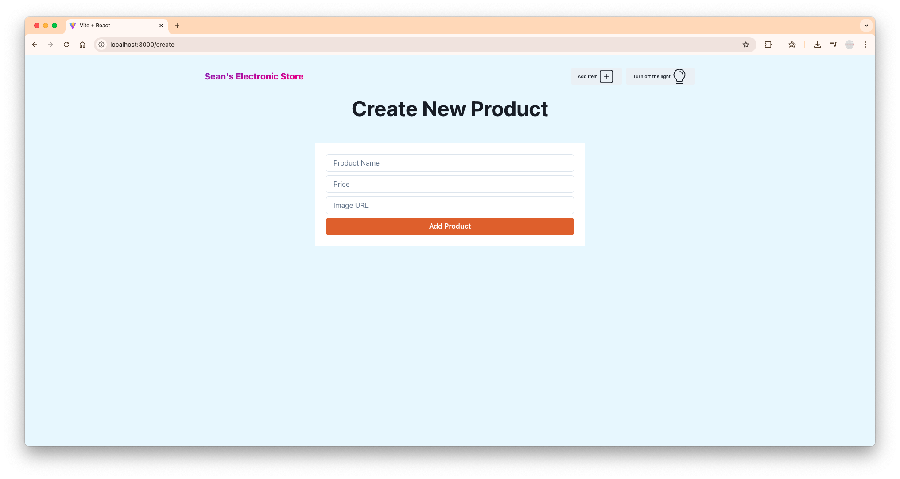
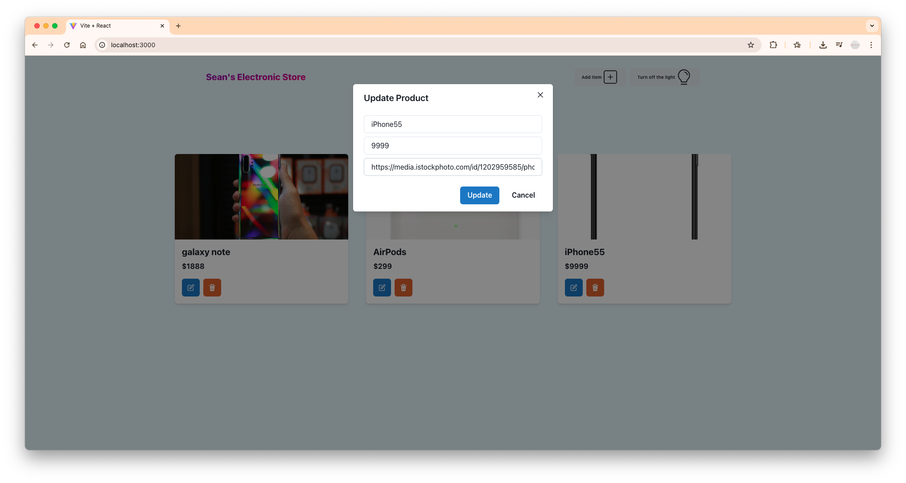

# 🛒 Full-Stack Product Management App

A responsive full-stack web application for managing electronic products, built with **Node.js**, **Express**, **MongoDB**, and **React**. Styled with **Chakra UI**, and powered by **Zustand** for state management.

---

## 🚀 Tech Stack

### 🖥 Frontend
- **React** with [Vite](https://vitejs.dev/)
- **React Router DOM** – client-side routing
- **Zustand** – lightweight global state management
- **Chakra UI** – modern, accessible UI components

### 🔧 Backend
- **Node.js** + **Express.js**
- **MongoDB** with **Mongoose**
- **RESTful API** architecture

---

## ✨ Features

- 🔄 **Full CRUD for products** via a REST API
- 🧭 **Page Routing** – Home page & Create product page
- 🌐 **Global Navbar** with theme toggle & navigation
- 🎨 **Responsive UI** using Chakra components
- 📦 **State management** via Zustand (fetch, create, update, delete products)
- 🧠 **Clean folder structure** with MVC separation
- 📡 **JSON API** with Express middleware
- 🗃️ **MongoDB persistence** with timestamped schemas

---

## 📸 Screenshots

- HomePage
<p align="center">
  
  <br/>
  <em>HomePage</em>
</p>

- CreatePage
<p align="center">
  
  <br/>
  <em>CreatePage</em>
</p>

- ProductCart Modal

<p align="center">
  
  <br/>
  <em>ProductModal after clicking on edit button</em>
</p>

---

## 🔧 Getting Started

### 1. Backend Setup

```bash
cd backend
npm install
```

Create a `.env` file in the root folder:

```env
PORT=3000
MONGO_URL=your_mongo_connection_string
```

> ℹ️ The `NODE_ENV` is automatically handled via `package.json` scripts.

Start the backend server:
```bash
npm run dev
```

### 2. Frontend Setup

```bash
cd frontend
npm install
npm run dev
```

---

## 🧠 Future Improvements

- 🔐 Add **user authentication** (JWT)
- ✅ Implement **form validations** (Yup or Joi)
- 🌀 Add **loading indicators** and **error boundaries**
- 📱 Improve **mobile responsiveness**
- 🧪 Add **unit and integration tests**
- 🌍 Add **i18n multi-language support**

---

## 📁 Folder Structure

```
├── backend/
│   ├── controllers/
│   ├── models/
│   ├── routes/
│   ├── config/
│   └── server.js
├── frontend/
│   ├── components/
│   ├── pages/
│   ├── store/
│   └── main.jsx
```

---

## 📄 License

MIT License © 2025 Sean
